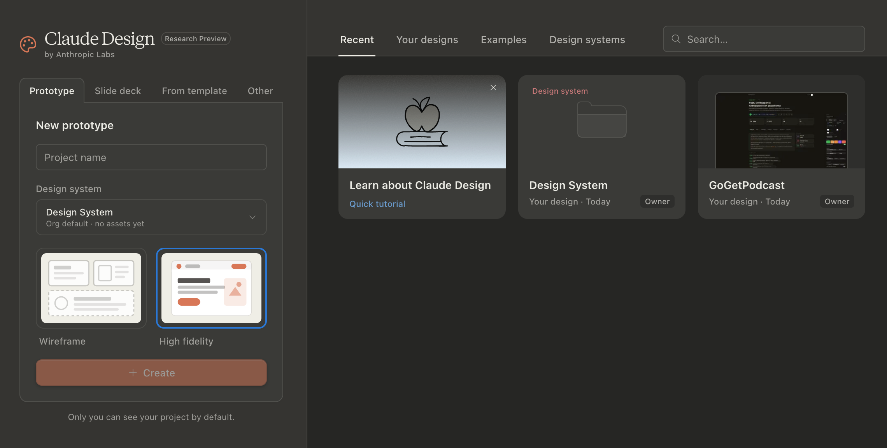

[](https://addons.mozilla.org/firefox/addon/gloam-claude-design/)
[](https://addons.mozilla.org/firefox/addon/gloam-claude-design/)
[](https://www.mozilla.org/firefox/)
[](https://www.chromium.org/)
[](https://t.me/ntuzov)

[](https://github.com/justskiv/gloam-claude-design/actions/workflows/ci.yml)
[](https://codecov.io/gh/justskiv/gloam-claude-design)
[](https://coveralls.io/github/justskiv/gloam-claude-design?branch=main)

# Gloam — Dark Theme for Claude Design

A minimal browser extension that gives the **[Claude Design](https://claude.ai/design)
native panels** a dark theme matching Claude's own warm-charcoal palette — while
leaving the **design preview pixel-for-pixel untouched**. Firefox uses the root
Manifest V3 package; Chromium builds are generated into `dist/chromium`.

<p align="center">
  
</p>

## Why

The Claude Design tool ships no dark mode and renders its chrome in a light
"paper" palette. The design preview you are working on, however, must stay
exactly as you authored it. Gloam darkens only the surrounding interface
(chat, header, tabs, cards, toolbars) and never the preview.

## Features

- 🌑 Native-feeling Claude dark palette (warm charcoal, real `#d97757` accent).
- 🪟 The design preview is **never** modified — it lives in a cross-origin
  iframe the extension cannot and does not reach.
- 🔘 One-click toolbar toggle; the on/off state is remembered.
- 🧯 Off means **off** — disabling restores the page byte-for-byte.
- 🪶 Tiny and dependency-free: one content script, one stylesheet, one icon.

## How it works

Claude's UI is built with styled-components whose class hashes change on every
deploy, so theming by selector would break constantly. Instead Gloam remaps the
page's own colors **by value** — the brand design tokens (`#faf9f5`,
`rgba(15,12,8,…)`, `#d97757`, …) are stable. The remap is **role-aware**: a light
color used as a background becomes dark, but the same color used as text stays
light. A luminance fallback recolors any near-neutral shade that is not in the
token table, so the theme keeps working as Claude evolves.

## Install

### From Firefox Add-ons (recommended)

> Coming soon — the AMO listing link will go here once published.

### From Chrome Web Store

> Coming soon — the Chrome Web Store listing link will go here once published.

### Temporary load in Firefox (for trying it out / development)

1. Open `about:debugging#/runtime/this-firefox`.
2. **Load Temporary Add-on…**
3. Select `manifest.json` in this folder.

The add-on stays loaded until you restart Firefox.

### Load unpacked in Chromium

1. Run `npm run build:chromium-source`.
2. Open your browser's extensions page (`chrome://extensions` in most
   Chromium browsers).
3. Enable **Developer mode**.
4. Choose **Load unpacked** and select `dist/chromium`.

### Manual install (signed `.xpi`)

Download the latest signed `.xpi` from the
[Releases](../../releases) page, then open `about:addons` → ⚙ →
**Install Add-on From File…**.

## Usage

Click the **Gloam** toolbar button to toggle the dark theme. When enabled the
theme applies automatically on every `claude.ai/design` tab; when disabled the
page is left completely unchanged. The button title and badge reflect the state.

## Permissions

| Permission                    | Why                                               |
| ----------------------------- | ------------------------------------------------- |
| `storage`                     | Remember the on/off toggle (a single local flag). |
| access to `claude.ai/design*` | Inject the theme only on the Claude Design tool.  |

## Privacy

Gloam collects and transmits **nothing**. There is no tracking, no network
request, and no remote code. The only stored value is your local on/off
preference. Firefox declares `data_collection_permissions: ["none"]`; the Chrome
Web Store privacy listing is configured manually before the API update workflow
is enabled.

## Development

Firefox runs directly from the repository root. Chromium source is generated
into `dist/chromium`. Use [Task](https://taskfile.dev/) or run the tools
directly with `npx` / `npm`:

```bash
task install                 # npm install
task run                     # Firefox + auto-reload
task run:chromium            # Chromium + generated dist/chromium
task lint                    # Firefox/Chromium package checks + eslint/stylelint/prettier
task lint:firefox            # validate the root Firefox package
task lint:chromium           # generate and validate dist/chromium
task test                    # node --test
task coverage                # node --test + c8, writes coverage/lcov.info
task build                   # Firefox ZIP in web-ext-artifacts/
task build:chromium-source   # generate dist/chromium
task build:chromium          # Chromium ZIP in web-ext-artifacts/chromium/
task build:all               # build both packages
task sign                    # signed .xpi (AMO keys)
```

Plain equivalents without Task:

```bash
npx web-ext run
npm run build:chromium-source
npm run run:chromium
npm run lint:firefox
npm run lint:chromium
npm test
npm run coverage
npm run build:all
npx web-ext sign --channel=unlisted
```

### Tests

The pure color engine (`color.js`) and manifest split are unit-tested with
`node --test`, and coverage is reported to Codecov and Coveralls in CI. The DOM
glue (`content.js`, `background.js`) is exercised in the browser, not
unit-tested.

### Tweaking the palette

All colors live in `color.js` — the `TOKENS` map (light source token → dark
target) and the luminance fallback in `mapColor`. The page-level base color,
scrollbar and hover affordance live in `dark.css`.

## Releasing

CI runs on every push/PR to `main`. Publishing is **tag-driven**: bump
`version` in `manifest.json`, push a tag like `v0.2.0`, and the release workflow
builds the Firefox ZIP plus Chromium ZIP, signs/submits to AMO when
`AMO_JWT_ISSUER` / `AMO_JWT_SECRET` are set, and attaches both unsigned
packages to a GitHub Release.

Chrome Web Store publishing is optional and uses the official API v2 after the
first listing/privacy setup is completed manually. Configure GitHub vars
`CWS_PUBLISHER_ID` and `CWS_EXTENSION_ID`, plus secrets `CWS_CLIENT_ID`,
`CWS_CLIENT_SECRET`, and `CWS_REFRESH_TOKEN`; the workflow refreshes an access
token, uploads the Chromium ZIP, waits for upload processing to finish, and
submits it for review.

Release workflow reruns for the same tag are not idempotent: AMO and Chrome Web
Store both expect a new extension version for a new upload.

For a permanent personal Firefox install without publishing, `task sign`
produces a signed `.xpi` you can load from `about:addons`.

## License

[MIT](LICENSE) © Nikolay Tuzov
